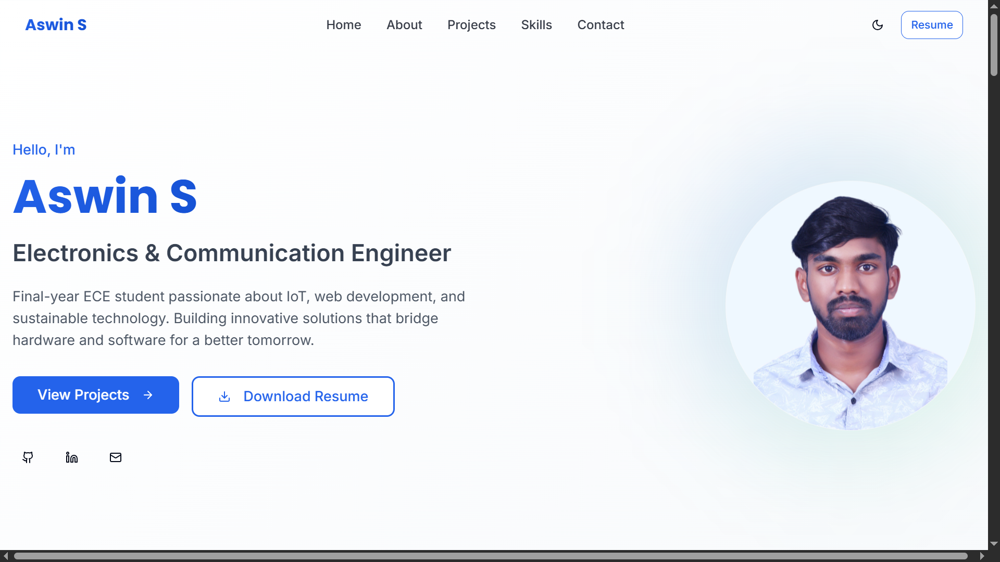
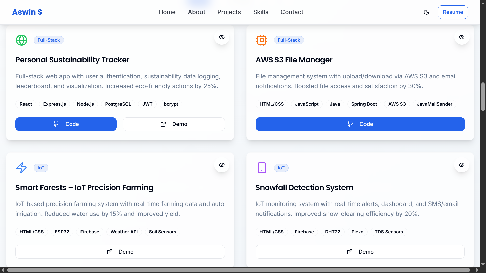
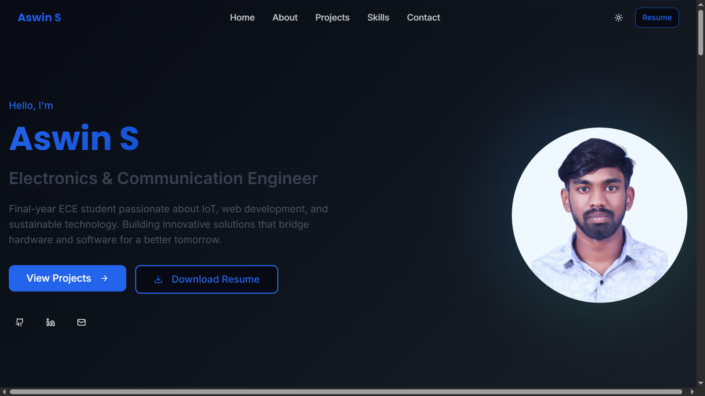
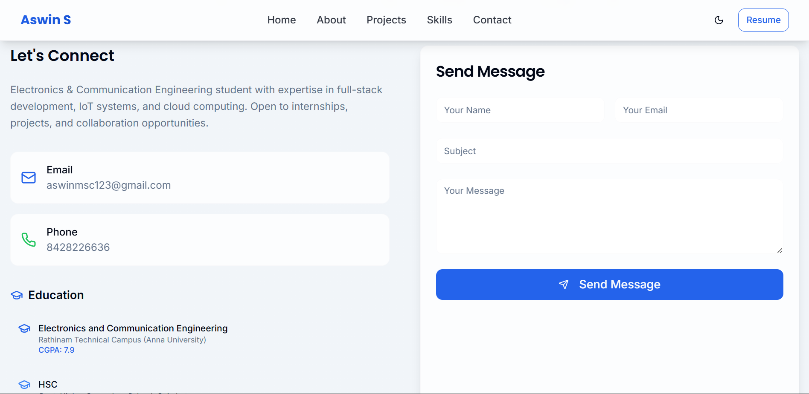

# 🌐 Personal Developer Portfolio

> A modern, interactive, and fully responsive personal portfolio website showcasing my skills, projects, certifications, and professional experiences as an Electronics & Communication Engineer.

---

## 🧠 Overview

This portfolio website serves as a central hub to present my journey, expertise, and projects in the fields of web development, IoT, and sustainable technology.  
It's designed to provide a comprehensive view of my capabilities, from front-end development and UI/UX design to backend integration and problem-solving.

---

## 🚀 Live Demo

🌐 [View Portfolio Website](https://portfolio-aswin04.vercel.app/)

---

## 🔧 Tech Stack

- **Frontend Framework**: React  
- **Styling**: Tailwind CSS  
- **UI Components**: Shadcn/ui  
- **State Management**: React Context API (for global theme management)  
- **Routing**: React Router DOM (for single-page application navigation and 404 handling)  
- **Form Handling**: Axios (for HTTP requests to Formspree)  
- **Image Carousel**: Embla Carousel React  
- **Icons**: Lucide-React  
- **Utility Functions**: clsx and tailwind-merge (for efficient class management)  
- **Deployment**: Vercel  

---

## 📂 Features

### 🔹 Interactive Home (Hero) Section
- Dynamic Introduction with fade-in-up animations
- Call-to-Actions: “View Projects,” “Contact Me,” “Download Resume”
- Social Links: GitHub, LinkedIn, Email
- Animated floating profile image for modern aesthetics

### 🔹 Comprehensive About Section
- Highlights: Anna University, Southern Railways Internship, Hackathon Leadership, Innovation Projects
- Glass-effect cards for key accomplishments

### 🔹 Detailed Skills & Expertise Module
- Categorized Skills: Programming Languages, Web & Cloud Technologies, Tools, IoT/Embedded Systems
- Certifications: Hover-enabled, clickable badges for verification
- Dynamic Internship Cards: Responsive layout with hover animations
- Soft Skills & Languages included

### 🔹 Engaging Projects Showcase
- Diverse project portfolio with tech stacks and icons
- Modal popups with in-depth info and image carousels
- Direct GitHub/live demo links
- Project filtering by category

### 🔹 Streamlined Contact Section
- Functional contact form via Formspree
- Toast notifications for submission status
- Displays email, phone, and location
- Social links repeated for easy access

### 🔹 Global Features & Enhancements
- Fully responsive design (desktop, tablet, mobile)
- Dark/Light Theme Toggle with localStorage persistence
- Smooth scrolling navigation
- CSS animations: float, fadeInUp, slideInLeft
- Custom utility classes: `text-gradient`, `glass-effect`
- Custom 404 page for invalid routes

---

## 🎯 Purpose & Impact

This project was built to:
- Establish a professional online presence
- Present my project portfolio to recruiters and hackathon judges
- Practice responsive UI/UX design principles
- Learn and apply deployment workflows (Vercel)

---

## ✨ What I Learned

- Structuring and writing content that communicates my story effectively
- Responsive layout techniques and mobile-first design
- Handling deployment and version control using Git
- Importance of branding in technical portfolios

---

## 💡 Future Improvements

- Integrate a blog section for writing about projects or technical tutorials
- Add advanced animations using Framer Motion or GSAP
- Include testimonials or peer recommendations
- Improve accessibility (e.g., full keyboard navigation)
- Performance optimizations (lazy loading, code splitting)

---

## 📸 Screenshots

  
  



---

## 📄 Resume

📄 [Download My Resume](https://drive.google.com/drive/folders/1DQFLudEdHGhN86xVA2fbUdWDTR872zNr?usp=drive_link)  

---

## 🙋‍♂️ Author

**Aswin S**  
*Electronics & Communication Engineer | Full-Stack & IoT Developer*  

🔗 [LinkedIn](https://www.linkedin.com/in/aswin41/) • [GitHub](https://github.com/Aswin-2266) • [Portfolio](https://portfolio-aswin04.vercel.app/)

---

## 📜 License

This project is licensed under the **MIT License**. Feel free to fork and customize it for your own use!

---

## 📥 Clone & Customize

```bash
git clone https://github.com/Aswin-2266/Portfolio
cd Portfolio
npm install  # or yarn install

# Replace the Formspree endpoint in src/pages/Contact.tsx with your own:
# https://formspree.io/f/mkgbdoon

npm run dev  # or yarn dev
